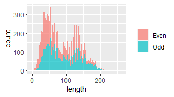

[](https://classroom.github.com/a/HUOoSZXh)
# Assignment 1 (R group) by CATculus

> Analysis of the Collatz Conjecture

- [Assignment questions](ASSIGNMENT.md) 
- Please also read [`INSTRUCTIONS.md`](INSTRUCTIONS.md) for specific
submission instructions and marking rubric.

## Background

The Collatz Conjecture is a mathematical conjecture concerning a
sequence defined as follows. Start with any positive integer $n$. Then
each term is obtained from the previous term according to these rules:

1.  If the previous term is even, the next term is one half of the
    previous term.
2.  If the previous term is odd, the next term is 3 times the previous
    term plus 1.

The conjecture is that no matter what value of $n$, the sequence will
always reach 1.

# Task 1: Generating The Collatz Conjecture

Firstly, we load the necessary libraries

```
library(tidyverse)
library(tibble)
library(dplyr)
```

Next, we create a function of the Collatz Conjecture iteration sequence called `gen_collatz` by developing a  `collatz_first` function to obtain the following number in the sequence.

```
# Set the functions

collatz_first <- function(n) { # for the first number after the starting integer value
 
  # check if n is a positive integer
  if (n <= 0 || n != as.integer(n)) {
    stop("Number should be a positive integer > 0")
  }
 
  while (n>=1) {
 
  # if n is even, the next term is one half of the previous term.  
  if (n %% 2 == 0) {
    return(n/2) }
 
  # if n is odd, the next term is 3 times the previous term plus 1.  
  else {
    return(3 * n + 1) }
  }
}

# collatz_first(5)
# collatz_first(27)

gen_collatz <- function(input) # for the Collatz sequence as a list
{
  result <- input
  while(input !=1)
  {
    input <- collatz_first(input)
    result <- c(result, input)
  }
  return(result)
}

# gen_collatz(20)
# gen_collatz(36)
```

We can then apply the function `gen_collatz` to starting integers ranging from 1-10,000 and store the results of the sequence in a tibble, along with other information such as the length of the sequence, parity (odd or even) and the maximum value in the sequence.

```
# Apply function to all integers from 1-10,000 and store in a tibble
start <- 1:10000

collatz_df <- tibble(start = integer(0),
                     seq=list(),
                     length= length(0),
                     parity= if ((0)%%2==0) {
                       print("Even")}
                     else {
                       print ("Odd")},
                     max_val= max((0), na.rm=FALSE))

for (i in 1:10000) {
  collatz_seq <- gen_collatz(i)
  if (!is.null(collatz_seq)) {
    collatz_df <- add_row(collatz_df,
                          start = i,
                          seq = list(collatz_seq),
                          length = length(collatz_seq),
                          parity= if ((i)%%2==0) {
                            print("Even")}
                          else {
                            print ("Odd")},
                          max_val= max((collatz_seq), na.rm = FALSE))
  }
 
}

print(i)

collatz_df
```

# Task 2: Exploratory Data Analysis

### Qn 1. Finding the top 10 starting integers that produces the longest sequences

```
top10longest <- collatz_df %>%
  select(c(start,length)) %>%
  arrange(desc(length)) %>%
  head(10) %>%
  t() %>%
  head(1)
  ```

Arranging length(column) by descending order and selecting only the top 10 rows of start(column) by using head() command to get top 10 starting integer with the longest sequences.

### Qn 2. Finding the starting integer with highest maximum value

```
max_val_int <- collatz_df %>%
  select(c(start,max_val)) %>%
  arrange(desc(max_val)) %>%
  head(1) %>%
  select(start)
```

The starting integer with the highest maximum value is obtained by arranging the max_val(column) in descending order, then using head() command to get the starting integer with highest maximum value

### Qn 3. Getting the average length and standard deviation of the sequence for even starting integers compared to odd ones

```
even_odd_mean_sd <- collatz_df %>%
  group_by(parity) %>%
  summarise(
    avg_len = mean(length),
    sd_len = sd(length)
  )

even_odd_avg_len <- select(even_odd_mean_sd, avg_len) %>%
  t()

even_odd_sd_len <- select(even_odd_mean_sd, sd_len) %>%
  t()
```
  
The average length and standard deviation of the sequence for even starting integers compared to the odd ones is obtained by using group_by() command on parity(column) and using summarise() command to get the average length and standard deviation for both even and odd starting integers.


# Task 3: Investing "backtracking" In Sequences
Backtracking is when a sequence reaches a value that is less than the starting integer, but then increases again above the starting integer at least once
before reaching 1.

### Qn 1. Filtering collatz_df to get starting integers which has backtracking in their sequences

```
# Introducing a function that can detect if backtracking in the sequence is present

backtrack_present <- function(seq,start) {
  for (i in seq) {
    if (i < start) {
      less_than_start <-  TRUE
    }
    if (less_than_start & i > start)
      return(TRUE)
  }
  return(FALSE)
}

less_than_start <- TRUE
if (less_than_start & i > start)
  return(TRUE)

# Applying the function into the sequence and filter collatz_df to get dataframe with sequence that has backtracking in it

backtracks_df <- collatz_df %>%
  rowwise() %>%
  mutate(backtrack = list(backtrack_present(seq, start)))%>%
  filter(backtrack==TRUE) %>%
  select(!backtrack)
  ```
Here, we introduce a function that can detect if there are any backtracking present in the sequence with [backtrack_present]. 
With the [backtrack_present] function, we apply it into the sequence and filter collatz_df to get the 
data frame with sequences where backtracking is present with [backtracks_df].

### Qn 2. What is the maximum value reached after the first backtrack for these sequences?

```
mode_above_starting_integer <- backtracks_df %>%
  as.integer(mode(backtracks_df))
```
Next, we find the frequently occurring number of times the sequence goes above the starting integer by finding the mode
with [mode_above_starting_integer].

### Qn 3. Maximum value after the first backtracking in the sequence

```
max_after_backtrack <- backtracks_df %>%
  arrange(desc(max_val)) %>%
  head(1) %>%
  select(max_val)
```
After that, we find the maximum value reached after the first backtrack for the sequences with [max_after_backtrack].

### Qn 4. Frequency count for even and odd backtracking integers

```
even_odd_backtrack <- backtracks_df %>%
  count(parity)
```

Lastly, we count the number of occurrences of even and off integers with backtracking present with [even_odd_backtrack]

# Task 4: Visualisations

Loading the ggplot library is necessary to create the visualisations of the Collatz Conjecture

```
library(ggplot2)
```

### 1. Scatterplot of starting integers and sequence length

```
# Use data frame from task 2 for the top 10 starting integer with longest lengths
top10longest

# Create scatterplot and identify the top 10 starting integers on the plot
ggplot(collatz_df, aes(x = start,
                       y = length,
                       label = ifelse(start %in% top10longest[start], as.character(start),""))) +
  geom_point() +
  geom_text(vjust = -0.5, hjust = -0.5) +
  labs(x = "Starting Integer",
       y = "Sequence Length",
       title = "Starting integer and Sequence Length")
```

A scatterplot of starting integers as the x-axis and the sequence lengths as the y-axis is produced with the help of ggplot.

We also take `top10longest` data frame from Task 2 to obtain the top 10 starting integer with the longest sequence lengths and use this to identify the top 10 starting integers on the plot.

### 2. Scatterplot of starting integers and highest value reached in the sequence

```
# Create data frame of top 10 starting integers with highest value
top10highest <- collatz_df %>%
  arrange(desc(max_val)) %>% # sorting in descending order
  head(10) %>%
  select(start, max_val)

# Create scatterplot and highlight the top 10 starting integers on the plot
ggplot(collatz_df, aes(x = start,        
                       y = max_val)) +  
  geom_point() +  
  geom_point(data = top10highest, aes(col="red")) +
labs( x = "Starting integer",      
      y = "Highest value reached in the sequence",    
      title = "Starting integer and highest value reached in the sequence")

```

In order to be able to highlight the top 10 starting integers, a new data frame must be created containing the top 10 starting integers with the highest values. The scatterplot with the highlighted plots can then be produced.

### 3. Boxplot comparing the distributions of sequence lengths for even and odd starting integers

```
ggplot(collatz_df, aes(x = parity,
                       y = length)) +
  geom_boxplot()

# There are outliers present in the boxplot distribution of the odd starting integers
```
Boxplot is created to compare the difference of the distributions of the sequence lengths for even and odd starting integers. Any noticeable differences is taken note.

# Task 5: Open-ended exploration

One interesting question or pattern about the Collatz conjecture:

What is the most frequent integer that appears in all the sequences combined, excluding the number 1?
Ans: In the Collatz conjecture, the most frequent integer that appears in all the sequences, excluding the number 1 is 2.

```
# Examples
gen_collatz(20)
# [1] 20 10  5 16  8  4  2  1

gen_collatz(9)
# [1]  9 28 14  7 22 11 34 17 52 26 13 40 20 10  5 16  8  4  2  1

gen_collatz(48)
# [1] 48 24 12  6  3 10  5 16  8  4  2  1
```
For every sequence, the number before the iteration ends at 1 is the number 2.
The reason for this is because for every step of the sequence;
if the number is odd, the next number is multiplied by 3 and plus 1 (3n+1), which is always even.
if the number is even, the next number is divided by 2 (n/2) which may be even or odd. This iteration continues until it reaches the numbers 2 & then 1.

# Task 6: Creative Visualisation Challenge

Visualizing some aspect of the Collatz Conjecture sequences that is interesting:
 
```
ggplot(collatz_df, aes(x= length)) +
  geom_histogram(aes(fill=parity),
                 bins=100,
                 alpha=0.7) +
  labs(fill=NULL)
```
  

# Contribution declaration

Task 1:
@suriyna
@syirahomar
@AmeliaElam

Task 2:

Qn 1 - @syirahomar @AmeliaElam
         
Qn 2 - @AmeliaElam @suriyna
         
Qn 3 - @syirahomar @suriyna
         
Task 3:
@AmeliaElam
@syirahomar

Task 4:
@suriyna

Task 5:
@suriyna

Task 6:
@AmeliaElam

README
@syirahomar